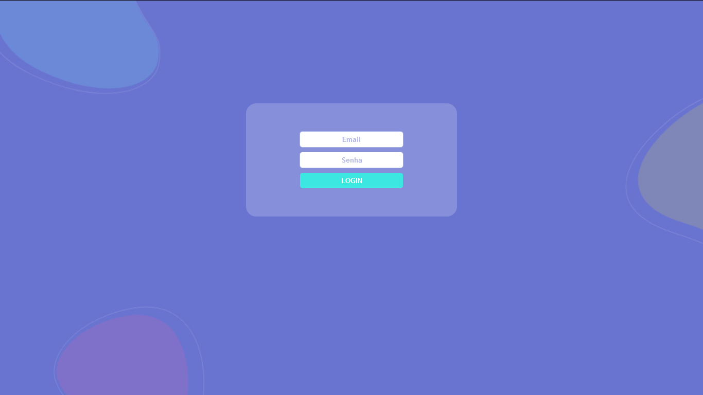

# LOGIN PAGE

<p align="center">
  <a href="https://github.com/thedarkzeno">
        
    </a>
  
</p>


> Simple login interface

<p align="center"></p>

## Summary 

- [Overview ](#eyes-overview)

- [Pre requisites](#warning-pre-requisites)

- [How to run](#construction_worker-how-to-run)

- [Dependencies](#books-dependecies)

- [License](#license)

## :eyes: Overview 

<p align="justify">
  A simple login page with redux.
</p>


## :warning: Pre requisites

- [Node](https://nodejs.org/en/download/)


## :construction_worker: How to run:

Clone the project from github:

```shell
git clone https://github.com/thedarkzeno/login-page
cd login-page
```

Install dependencies:

```shell
yarn
# or
npm i
```

Start the application:

```shell
yarn start
# or
npm start
```

## :books: Dependencies 

- [React](https://pt-br.reactjs.org/docs/create-a-new-react-app.html)
- [Redux](https://redux.js.org/)
- [Styled Components](https://styled-components.com/)


## License

The [MIT License]() (MIT)


---

<p align="center">
Made with :heart: by <a href="https://www.linkedin.com/in/adalberto-junior-62618a176/">Adalberto</a>
</p>

